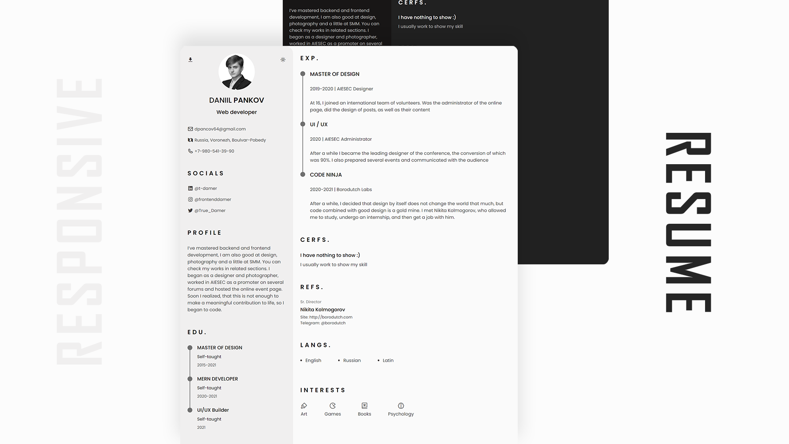

# Responsive Resume

---

## Demo

## How to launch locally?

Simply `git clone https://github.com/T-Damer/yourCV.git`\
Then `cd yourCV` into folder\
Launch `index.html`

I personally use vscode `live server` extension, so it runs on `localhost:5500`

---

